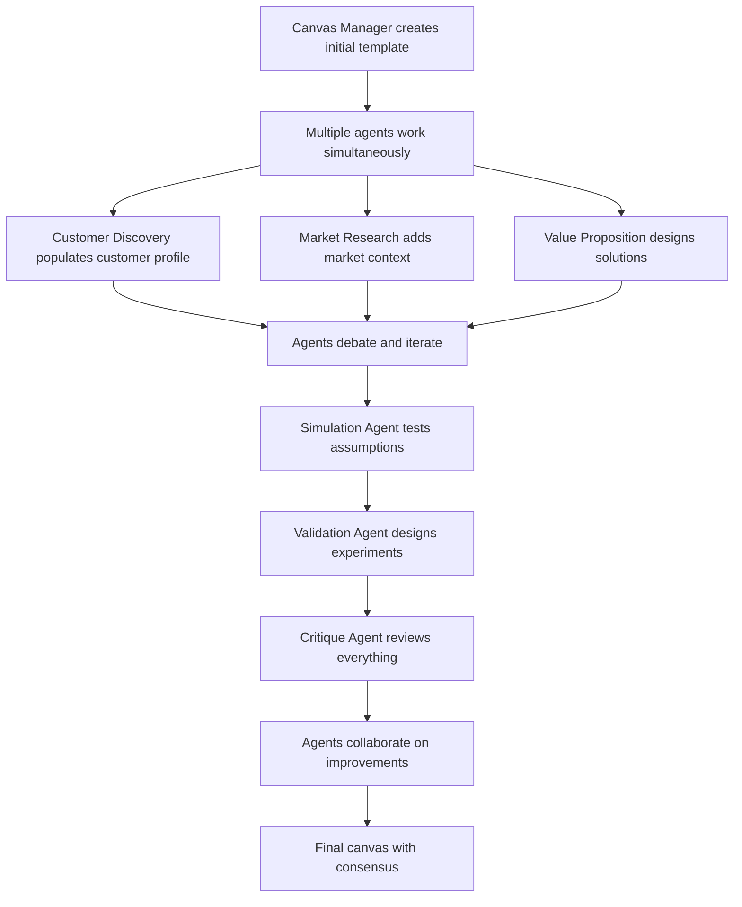
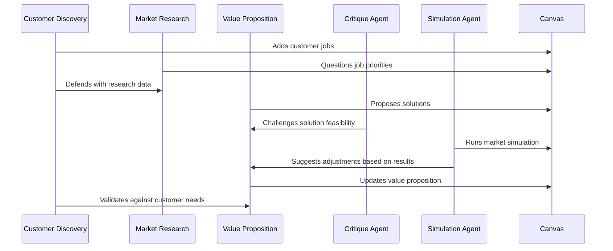
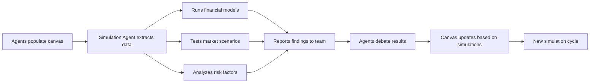

# Collaborative Multi-Agent Canvas Architecture
## True OpenAI-Style Multi-Agent Collaboration for Strategyzer Consulting

### Overview

This architecture transforms the sequential pipeline into a **true collaborative multi-agent system** where agents work simultaneously on shared canvases, debate findings, iterate on each other's work, and run simulations together.

---

## Core Collaborative Principles

### 1. Shared Workspace Model
- **Living Canvas**: All agents work on the same canvas simultaneously
- **Real-time Updates**: Agents see each other's contributions in real-time
- **Version Control**: Track who changed what and when
- **Conflict Resolution**: Agents negotiate when they disagree

### 2. Agent Roles & Collaboration Patterns

#### **Canvas Manager Agent** 🎨
- **Role**: Maintains canvas structure and integrity
- **Responsibilities**:
  - Creates initial canvas templates
  - Ensures data consistency across sections
  - Resolves conflicts between agent updates
  - Maintains canvas version history
- **Collaboration**: Coordinates with all other agents

#### **Customer Discovery Agent** 👥
- **Role**: Populates customer profile sections
- **Responsibilities**:
  - Jobs-to-be-done identification
  - Pain points analysis
  - Gains mapping
- **Collaboration**: 
  - Debates findings with Market Research Agent
  - Validates assumptions with Validation Agent
  - Iterates based on Value Proposition Agent feedback

#### **Market Research Agent** 📊
- **Role**: Provides market context and competitive intelligence
- **Responsibilities**:
  - Market sizing and trends
  - Competitive landscape analysis
  - Market opportunity identification
- **Collaboration**:
  - Challenges Customer Discovery assumptions
  - Provides data to Value Proposition Agent
  - Debates market positioning with Business Model Agent

#### **Value Proposition Agent** 💡
- **Role**: Designs value propositions and pain relievers
- **Responsibilities**:
  - Products & services definition
  - Pain relievers design
  - Gain creators specification
- **Collaboration**:
  - Uses Customer Discovery insights
  - Incorporates Market Research data
  - Debates feasibility with Business Model Agent
  - Validates with Simulation Agent

#### **Business Model Agent** 🏗️
- **Role**: Designs business model architecture
- **Responsibilities**:
  - Revenue streams design
  - Cost structure analysis
  - Key partnerships identification
  - Channel strategy
- **Collaboration**:
  - Builds on Value Proposition work
  - Debates sustainability with Financial Simulation Agent
  - Validates with Market Research Agent

#### **Simulation Agent** 🧪
- **Role**: Runs experiments and simulations on canvas data
- **Responsibilities**:
  - Financial modeling
  - Market penetration simulations
  - Risk analysis
  - Scenario planning
- **Collaboration**:
  - Tests assumptions from all other agents
  - Provides feedback to Business Model Agent
  - Challenges unrealistic projections
  - Suggests iterations to Value Proposition Agent

#### **Validation Agent** ✅
- **Role**: Designs experiments to test canvas assumptions
- **Responsibilities**:
  - Hypothesis formulation
  - Experiment design
  - Success metrics definition
  - Testing roadmap creation
- **Collaboration**:
  - Questions all agents' assumptions
  - Designs tests for Customer Discovery findings
  - Validates Value Proposition hypotheses
  - Tests Business Model assumptions

#### **Critique Agent** 🔍
- **Role**: Provides critical analysis and devil's advocate perspective
- **Responsibilities**:
  - Identifies logical inconsistencies
  - Challenges assumptions
  - Suggests alternative approaches
  - Quality assurance
- **Collaboration**:
  - Reviews all agents' work
  - Initiates debates and discussions
  - Forces deeper thinking
  - Ensures rigorous analysis

---

## Collaborative Workflows

### 1. Canvas Co-Creation Process



### 2. Agent Debate & Iteration Cycle



### 3. Simulation & Testing Integration



---

## Technical Implementation

### 1. Shared Canvas Data Structure

```javascript
const CollaborativeCanvas = {
  id: "canvas_uuid",
  type: "value_proposition_canvas",
  version: 3,
  lastUpdated: "2025-01-15T10:30:00Z",
  
  // Shared workspace
  workspace: {
    customerProfile: {
      jobs: {
        functional: [],
        emotional: [],
        social: [],
        lastUpdatedBy: "customer_discovery_agent",
        lastUpdated: "2025-01-15T10:25:00Z",
        comments: [
          {
            agent: "market_research_agent",
            comment: "Consider enterprise vs SMB job differences",
            timestamp: "2025-01-15T10:26:00Z"
          }
        ]
      },
      pains: {
        data: [],
        lastUpdatedBy: "customer_discovery_agent",
        confidence: 0.85,
        validatedBy: ["simulation_agent"]
      },
      gains: {
        data: [],
        lastUpdatedBy: "customer_discovery_agent",
        challengedBy: ["critique_agent"],
        status: "under_review"
      }
    },
    
    valueMap: {
      productsServices: {
        data: [],
        lastUpdatedBy: "value_proposition_agent",
        simulationResults: {
          marketFit: 0.78,
          feasibility: 0.82,
          lastSimulated: "2025-01-15T10:28:00Z"
        }
      },
      painRelievers: {
        data: [],
        lastUpdatedBy: "value_proposition_agent",
        validationExperiments: [
          {
            hypothesis: "Feature X reduces pain Y by 50%",
            designedBy: "validation_agent",
            status: "pending"
          }
        ]
      }
    }
  },
  
  // Agent collaboration metadata
  collaboration: {
    activeAgents: ["customer_discovery", "value_proposition", "simulation"],
    debates: [
      {
        topic: "Target customer segment priority",
        participants: ["customer_discovery", "market_research"],
        status: "ongoing",
        messages: []
      }
    ],
    consensus: {
      customerSegment: {
        agreed: ["customer_discovery", "market_research"],
        dissenting: ["critique_agent"],
        confidence: 0.75
      }
    }
  },
  
  // Simulation results
  simulations: {
    financial: {
      revenue: { projection: 1000000, confidence: 0.7 },
      costs: { projection: 600000, confidence: 0.8 },
      lastRun: "2025-01-15T10:29:00Z",
      runBy: "simulation_agent"
    },
    market: {
      penetration: { projection: 0.05, confidence: 0.6 },
      timeToMarket: { projection: 12, confidence: 0.8 }
    }
  }
};
```

### 2. Agent Communication Protocol

```javascript
class AgentCommunication {
  async sendMessage(fromAgent, toAgent, message, canvasId) {
    return {
      id: "msg_uuid",
      from: fromAgent,
      to: toAgent,
      message: message,
      canvasId: canvasId,
      timestamp: new Date(),
      type: "debate" | "question" | "suggestion" | "challenge"
    };
  }
  
  async broadcastToTeam(fromAgent, message, canvasId) {
    // Send to all agents working on this canvas
  }
  
  async initiateDebate(topic, participants, canvasId) {
    // Start structured debate between agents
  }
}
```

### 3. Collaborative Agent Runner

```javascript
class CollaborativeAgentOrchestrator {
  constructor() {
    this.activeCanvases = new Map();
    this.agentTeams = new Map();
    this.debateManager = new DebateManager();
  }
  
  async startCollaborativeSession(canvasType, clientId) {
    // 1. Create shared canvas
    const canvas = await this.createSharedCanvas(canvasType, clientId);
    
    // 2. Assemble agent team
    const team = this.assembleAgentTeam(canvasType);
    
    // 3. Start collaborative work
    return this.orchestrateCollaboration(canvas, team);
  }
  
  async orchestrateCollaboration(canvas, team) {
    // Agents work simultaneously on different canvas sections
    const workPromises = team.map(agent => 
      this.startAgentWork(agent, canvas)
    );
    
    // Monitor for conflicts and debates
    this.monitorCollaboration(canvas, team);
    
    // Run simulation cycles
    this.scheduleSimulations(canvas);
    
    return canvas;
  }
  
  async handleAgentDebate(debate) {
    // Facilitate structured debate between agents
    // Let them argue, present evidence, reach consensus
  }
}
```

---

## Collaboration Scenarios

### Scenario 1: Customer Segment Debate
1. **Customer Discovery Agent** identifies "Small businesses" as primary segment
2. **Market Research Agent** challenges: "Enterprise has 10x revenue potential"
3. **Simulation Agent** runs models for both segments
4. **Critique Agent** questions assumptions in both analyses
5. **Validation Agent** designs experiments to test both hypotheses
6. **Team reaches consensus** based on evidence and simulations

### Scenario 2: Value Proposition Iteration
1. **Value Proposition Agent** proposes solution features
2. **Customer Discovery Agent** validates against customer jobs
3. **Simulation Agent** tests financial viability
4. **Business Model Agent** questions scalability
5. **Agents iterate together** until solution is validated

### Scenario 3: Canvas Quality Assurance
1. **All agents** populate their sections
2. **Critique Agent** identifies inconsistencies
3. **Simulation Agent** finds unrealistic assumptions
4. **Team debates and refines** until canvas is coherent

---

## Benefits of Collaborative Architecture

1. **Higher Quality Output**: Multiple perspectives and validation
2. **Reduced Bias**: Agents challenge each other's assumptions
3. **Realistic Solutions**: Simulations test viability in real-time
4. **Iterative Improvement**: Continuous refinement through collaboration
5. **Comprehensive Analysis**: No blind spots due to multiple viewpoints
6. **Client-Ready Artifacts**: Thoroughly vetted and validated canvases

---

This architecture transforms the platform from a simple pipeline into a **sophisticated consulting team** where AI agents truly collaborate, debate, and iterate together - just like human consultants working on strategic projects.
