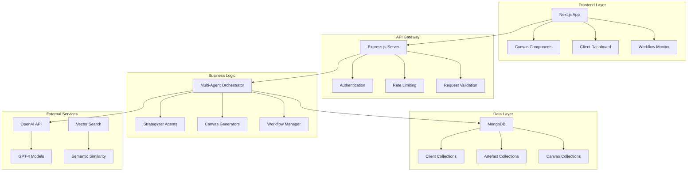

# 🔧 Engineering Implementation Guide

## Single Source of Engineering Truth

This document provides comprehensive engineering specifications for implementing the **Strategyzer AI Architecture** using the MERN stack, building upon the existing codebase infrastructure.

---

## 📋 Technology Stack Overview

### **Current Implementation**

```yaml
Frontend:
  Framework: Next.js 15.4.5
  UI Library: Radix UI + Tailwind CSS
  State Management: TanStack React Query
  HTTP Client: Axios
  Testing: Jest + Playwright

Backend:
  Runtime: Node.js (ES Modules)
  Framework: Express.js 4.21.1
  Database: MongoDB 8.8.4 (Mongoose ODM)
  AI Integration: OpenAI 4.73.1
  Monitoring: OpenTelemetry + Prometheus
  Testing: Vitest

Infrastructure:
  Containerization: Docker + Docker Compose
  Deployment: Google Cloud Platform
  CI/CD: GitHub Actions
  Environment: Production-ready with health checks
```

### **Architecture Alignment**

The current MERN stack perfectly supports the Strategyzer AI Architecture requirements:

- ✅ **MongoDB**: AI-optimized schema with vector embeddings
- ✅ **Express.js**: RESTful API for multi-agent orchestration
- ✅ **React/Next.js**: Interactive canvas generation and visualization
- ✅ **Node.js**: AI agent execution and workflow management

---

## 🏗️ System Architecture

### **High-Level Architecture**



### **Directory Structure**

```text
/home/chris/andrewCave/
├── backend/                          # Express.js Backend
│   ├── server/
│   │   ├── index.js                 # Main server entry point
│   │   ├── routes.js                # API route definitions
│   │   └── middleware/              # Custom middleware
│   ├── agents/                      # AI Agent implementations
│   │   ├── strategyzer/             # Strategyzer-specific agents
│   │   ├── orchestration/           # Multi-agent orchestration
│   │   └── canvas/                  # Canvas generation agents
│   ├── models/                      # MongoDB schemas
│   │   ├── Client.js
│   │   ├── Artefact.js
│   │   └── Canvas.js
│   ├── services/                    # Business logic services
│   └── utils/                       # Utility functions
├── frontend/                        # Next.js Frontend
│   ├── src/
│   │   ├── pages/                   # Next.js pages
│   │   ├── components/             # React components
│   │   ├── services/               # API integration
│   │   └── hooks/                  # Custom React hooks
├── docs/                           # Documentation
└── tests/                          # Test suites
```

---

## 🗄️ Database Schema Implementation

### **Enhanced MongoDB Collections**

#### 1. **Clients Collection**

```javascript
// /backend/models/Client.js
import mongoose from 'mongoose';

const ClientSchema = new mongoose.Schema({
  name: { type: String, required: true },
  email: { type: String, required: true, unique: true },
  company: { type: String },
  industry: { type: String },
  description: { type: String },
  
  // Strategyzer-specific fields
  businessContext: {
    stage: { type: String, enum: ['startup', 'growth', 'mature', 'pivot'] },
    targetMarket: String,
    currentChallenges: [String],
    objectives: [String]
  },
  
  // Workflow tracking
  workflowStatus: {
    discovery: {
      status: { type: String, enum: ['not_started', 'in_progress', 'completed'], default: 'not_started' },
      startedAt: Date,
      completedAt: Date,
      progress: { type: Number, default: 0 }
    },
    validation: {
      status: { type: String, enum: ['not_started', 'in_progress', 'completed'], default: 'not_started' },
      startedAt: Date,
      completedAt: Date,
      progress: { type: Number, default: 0 }
    },
    scale: {
      status: { type: String, enum: ['not_started', 'in_progress', 'completed'], default: 'not_started' },
      startedAt: Date,
      completedAt: Date,
      progress: { type: Number, default: 0 }
    }
  },
  
  // Canvas tracking
  canvases: {
    valueProposition: { type: mongoose.Schema.Types.ObjectId, ref: 'Canvas' },
    businessModel: { type: mongoose.Schema.Types.ObjectId, ref: 'Canvas' },
    testingBusinessIdeas: { type: mongoose.Schema.Types.ObjectId, ref: 'Canvas' }
  },
  
  // Metadata
  createdAt: { type: Date, default: Date.now },
  updatedAt: { type: Date, default: Date.now }
});

// Indexes for performance
ClientSchema.index({ email: 1 });
ClientSchema.index({ 'workflowStatus.discovery.status': 1 });

export default mongoose.model('Client', ClientSchema);
```

#### 2. **Enhanced Artefacts Collection**

```javascript
// /backend/models/Artefact.js
import mongoose from 'mongoose';

const ArtefactSchema = new mongoose.Schema({
  // Core identification
  clientId: { type: mongoose.Schema.Types.ObjectId, ref: 'Client', required: true, index: true },
  
  // AI Agent metadata
  agentId: { type: String, required: true },
  agentType: {
    type: String,
    required: true,
    enum: [
      'customerJobsAgent', 'customerPainsAgent', 'customerGainsAgent',
      'valueMapAgent', 'fitAssessmentAgent',
      'keyPartnersAgent', 'keyActivitiesAgent', 'keyResourcesAgent',
      'valuePropositionsAgent', 'customerRelationshipsAgent', 'channelsAgent',
      'customerSegmentsAgent', 'costStructureAgent', 'revenueStreamsAgent',
      'hypothesisFormationAgent', 'experimentDesignAgent', 'evidenceCollectionAgent',
      'workflowOrchestratorAgent', 'canvasGeneratorAgent', 'qualityAssuranceAgent'
    ]
  },
  workflowId: { type: String, required: true },
  workflowStage: { 
    type: String, 
    required: true,
    enum: ['discovery', 'validation', 'scale'],
    index: true
  },
  
  // AI-optimized content structure
  content: {
    raw: mongoose.Schema.Types.Mixed,
    structured: {
      analysis: String,
      recommendations: [String],
      nextSteps: [String],
      insights: [String],
      confidence: { type: Number, min: 0, max: 1 },
      reasoning: String,
      canvasSection: String,
      strategicImplications: [String],
      validationCriteria: [String]
    },
    embeddings: {
      content_vector: [Number],
      semantic_vector: [Number],
      summary_vector: [Number]
    },
    metadata: {
      model_used: String,
      processing_time: Number,
      token_count: Number,
      cost: Number,
      quality_score: { type: Number, min: 0, max: 1 }
    }
  },
  
  // Workflow execution context
  execution: {
    input_context: mongoose.Schema.Types.Mixed,
    output_context: mongoose.Schema.Types.Mixed,
    agent_state: mongoose.Schema.Types.Mixed,
    dependencies: [{ type: mongoose.Schema.Types.ObjectId, ref: 'Artefact' }],
    dependents: [{ type: mongoose.Schema.Types.ObjectId, ref: 'Artefact' }]
  },
  
  // Quality and validation
  validation: {
    is_validated: { type: Boolean, default: false },
    validation_score: { type: Number, min: 0, max: 1 },
    validation_notes: String,
    human_reviewed: { type: Boolean, default: false }
  },
  
  // Search optimization
  searchable_content: String,
  tags: [String],
  keywords: [String],
  
  // Status tracking
  status: { 
    type: String, 
    enum: ['pending', 'processing', 'completed', 'failed'], 
    default: 'pending',
    index: true
  },
  
  // Timestamps
  createdAt: { type: Date, default: Date.now },
  updatedAt: { type: Date, default: Date.now }
});

// Compound indexes for optimized queries
ArtefactSchema.index({ clientId: 1, workflowStage: 1, createdAt: -1 });
ArtefactSchema.index({ agentType: 1, 'content.metadata.quality_score': -1 });
ArtefactSchema.index({ tags: 1, keywords: 1 });

export default mongoose.model('Artefact', ArtefactSchema);
```

#### 3. **Canvas Collection**

```javascript
// /backend/models/Canvas.js
import mongoose from 'mongoose';

const CanvasSchema = new mongoose.Schema({
  clientId: { type: mongoose.Schema.Types.ObjectId, ref: 'Client', required: true, index: true },
  type: { 
    type: String, 
    required: true,
    enum: ['value_proposition_canvas', 'business_model_canvas', 'testing_business_ideas_canvas']
  },
  version: { type: Number, default: 1 },
  
  // Canvas content based on type
  content: mongoose.Schema.Types.Mixed,
  
  // Generation metadata
  generation: {
    generatedBy: [String],
    generationTime: Number,
    qualityScore: { type: Number, min: 0, max: 1 },
    humanReviewed: { type: Boolean, default: false },
    exportFormats: {
      svg: String,
      png: String,
      pdf: String
    }
  },
  
  // Status
  status: { 
    type: String, 
    enum: ['draft', 'in_progress', 'completed', 'reviewed'], 
    default: 'draft' 
  },
  
  // Timestamps
  createdAt: { type: Date, default: Date.now },
  updatedAt: { type: Date, default: Date.now }
});

export default mongoose.model('Canvas', CanvasSchema);
```

---

## 🤖 AI Agent Implementation

### **Base Agent Architecture**

```javascript
// /backend/agents/base/BaseAgent.js
import { OpenAI } from 'openai';

export class BaseAgent {
  constructor(agentId, agentType, config = {}) {
    this.agentId = agentId;
    this.agentType = agentType;
    this.config = {
      model: 'gpt-4',
      temperature: 0.7,
      max_tokens: 2000,
      ...config
    };
    this.openai = new OpenAI({ apiKey: process.env.OPENAI_API_KEY });
  }
  
  async execute(input, context = {}) {
    const startTime = Date.now();
    
    try {
      const processedInput = await this.preProcess(input, context);
      const response = await this.callOpenAI(processedInput);
      const structuredOutput = await this.postProcess(response, context);
      
      const artefact = await this.createArtefact(input, structuredOutput, {
        processing_time: Date.now() - startTime,
        model_used: this.config.model,
        token_count: response.usage?.total_tokens || 0,
        cost: this.calculateCost(response.usage)
      });
      
      return artefact;
      
    } catch (error) {
      console.error(`[${this.agentType}] Execution failed:`, error);
      throw error;
    }
  }
  
  async callOpenAI(input) {
    const response = await this.openai.chat.completions.create({
      model: this.config.model,
      messages: [
        { role: 'system', content: this.getSystemPrompt() },
        { role: 'user', content: input }
      ],
      temperature: this.config.temperature,
      max_tokens: this.config.max_tokens
    });
    
    return response;
  }
  
  getSystemPrompt() {
    return "You are a helpful AI assistant.";
  }
  
  calculateCost(usage) {
    if (!usage) return 0;
    const inputCost = (usage.prompt_tokens / 1000) * 0.03;
    const outputCost = (usage.completion_tokens / 1000) * 0.06;
    return inputCost + outputCost;
  }
}
```

---

## 🔄 API Routes Implementation

### **Enhanced Route Structure**

```javascript
// /backend/server/routes.js
import express from 'express';
import { StrategyzrWorkflowService } from '../services/workflowService.js';

const router = express.Router();
const workflowService = new StrategyzrWorkflowService();

// Health check
router.get('/health', (req, res) => {
  res.json({ status: 'healthy', timestamp: new Date().toISOString() });
});

// Client management
router.get('/clients', async (req, res) => {
  try {
    const Client = (await import('../models/Client.js')).default;
    const clients = await Client.find().sort({ createdAt: -1 });
    res.json(clients);
  } catch (error) {
    res.status(500).json({ error: error.message });
  }
});

router.post('/clients', async (req, res) => {
  try {
    const Client = (await import('../models/Client.js')).default;
    const client = await Client.create(req.body);
    res.status(201).json(client);
  } catch (error) {
    res.status(400).json({ error: error.message });
  }
});

// Workflow execution
router.post('/clients/:id/discovery', async (req, res) => {
  try {
    const result = await workflowService.executeDiscoveryWorkflow(req.params.id);
    res.json(result);
  } catch (error) {
    res.status(500).json({ error: error.message });
  }
});

router.post('/clients/:id/validation', async (req, res) => {
  try {
    const result = await workflowService.executeValidationWorkflow(req.params.id);
    res.json(result);
  } catch (error) {
    res.status(500).json({ error: error.message });
  }
});

router.post('/clients/:id/scale', async (req, res) => {
  try {
    const result = await workflowService.executeScaleWorkflow(req.params.id);
    res.json(result);
  } catch (error) {
    res.status(500).json({ error: error.message });
  }
});

// Canvas management
router.get('/clients/:id/canvas/:type', async (req, res) => {
  try {
    const Canvas = (await import('../models/Canvas.js')).default;
    const canvas = await Canvas.findOne({
      clientId: req.params.id,
      type: req.params.type
    });
    res.json(canvas);
  } catch (error) {
    res.status(500).json({ error: error.message });
  }
});

// Artefacts
router.get('/clients/:id/artefacts', async (req, res) => {
  try {
    const Artefact = (await import('../models/Artefact.js')).default;
    const artefacts = await Artefact.find({ clientId: req.params.id })
      .sort({ createdAt: -1 });
    res.json(artefacts);
  } catch (error) {
    res.status(500).json({ error: error.message });
  }
});

export default router;
```

---

## 🎨 Frontend Implementation

### **Canvas Visualization Component**

```typescript
// /frontend/src/components/canvas/ValuePropositionCanvas.tsx
import React from 'react';
import { Card, CardContent, CardHeader, CardTitle } from '@/components/ui/card';

interface CanvasProps {
  canvasData: any;
  onSectionClick?: (section: string) => void;
}

export const ValuePropositionCanvas: React.FC<CanvasProps> = ({ 
  canvasData, 
  onSectionClick 
}) => {
  return (
    <div className="grid grid-cols-2 gap-6 p-6">
      <Card className="cursor-pointer hover:shadow-lg" 
            onClick={() => onSectionClick?.('customer-profile')}>
        <CardHeader>
          <CardTitle>Customer Profile</CardTitle>
        </CardHeader>
        <CardContent>
          <div className="space-y-4">
            <div>
              <h4 className="font-semibold">Jobs</h4>
              <ul className="list-disc list-inside">
                {canvasData?.customerProfile?.jobs?.functional_jobs?.map((job: any, i: number) => (
                  <li key={i}>{job.job}</li>
                ))}
              </ul>
            </div>
            <div>
              <h4 className="font-semibold">Pains</h4>
              <ul className="list-disc list-inside">
                {canvasData?.customerProfile?.pains?.pain_points?.map((pain: any, i: number) => (
                  <li key={i}>{pain.pain}</li>
                ))}
              </ul>
            </div>
            <div>
              <h4 className="font-semibold">Gains</h4>
              <ul className="list-disc list-inside">
                {canvasData?.customerProfile?.gains?.desired_gains?.map((gain: any, i: number) => (
                  <li key={i}>{gain.gain}</li>
                ))}
              </ul>
            </div>
          </div>
        </CardContent>
      </Card>

      <Card className="cursor-pointer hover:shadow-lg" 
            onClick={() => onSectionClick?.('value-map')}>
        <CardHeader>
          <CardTitle>Value Map</CardTitle>
        </CardHeader>
        <CardContent>
          <div className="space-y-4">
            <div>
              <h4 className="font-semibold">Products & Services</h4>
              <ul className="list-disc list-inside">
                {canvasData?.valueMap?.products_services?.map((product: any, i: number) => (
                  <li key={i}>{product.name}</li>
                ))}
              </ul>
            </div>
            <div>
              <h4 className="font-semibold">Pain Relievers</h4>
              <ul className="list-disc list-inside">
                {canvasData?.valueMap?.pain_relievers?.map((reliever: any, i: number) => (
                  <li key={i}>{reliever.reliever}</li>
                ))}
              </ul>
            </div>
            <div>
              <h4 className="font-semibold">Gain Creators</h4>
              <ul className="list-disc list-inside">
                {canvasData?.valueMap?.gain_creators?.map((creator: any, i: number) => (
                  <li key={i}>{creator.creator}</li>
                ))}
              </ul>
            </div>
          </div>
        </CardContent>
      </Card>
    </div>
  );
};
```

---

## 🚀 Implementation Roadmap

### **Phase 1: Enhanced Schema & Base Agents (Week 1)**

1. **Database Schema Updates**
   - Implement enhanced Client, Artefact, and Canvas models
   - Add proper indexes for performance
   - Create migration scripts for existing data

2. **Base Agent Framework**
   - Implement BaseAgent class with OpenAI integration
   - Add quality assessment and cost tracking
   - Create agent execution pipeline

### **Phase 2: Strategyzer Agents (Week 2)**

1. **Value Proposition Canvas Agents**
   - CustomerJobsAgent
   - CustomerPainsAgent
   - CustomerGainsAgent
   - ValueMapAgent

2. **Workflow Orchestration**
   - StrategyzrWorkflowService
   - Multi-agent coordination
   - Canvas generation

### **Phase 3: Frontend Integration (Week 3)**

1. **Canvas Components**
   - ValuePropositionCanvas component
   - Interactive canvas sections
   - Real-time updates

2. **API Integration**
   - Enhanced API routes
   - Frontend service layer
   - Error handling

### **Phase 4: Testing & Optimization (Week 4)**

1. **Comprehensive Testing**
   - Unit tests for agents
   - Integration tests for workflows
   - End-to-end canvas generation tests

2. **Performance Optimization**
   - Query optimization
   - Caching strategies
   - Cost monitoring

---

## 📊 Monitoring & Analytics

### **Quality Metrics**

```javascript
// Quality assessment pipeline
const qualityMetrics = {
  agentPerformance: 'content.metadata.quality_score',
  processingTime: 'content.metadata.processing_time',
  costEfficiency: 'content.metadata.cost',
  workflowCompletion: 'workflowStatus.*.status',
  canvasGeneration: 'generation.qualityScore'
};
```

### **Performance Monitoring**

```javascript
// MongoDB aggregation for real-time analytics
const performanceAnalytics = await Artefact.aggregate([
  {
    $group: {
      _id: '$agentType',
      avgQuality: { $avg: '$content.metadata.quality_score' },
      avgProcessingTime: { $avg: '$content.metadata.processing_time' },
      totalCost: { $sum: '$content.metadata.cost' },
      count: { $sum: 1 }
    }
  },
  { $sort: { avgQuality: -1 } }
]);
```

---

## 🧪 Test-Driven Development (TDD) Methodology

### **TDD Implementation Strategy**

TDD is integrated throughout the engineering implementation to ensure code quality, maintainability, and reliability of AI agent workflows.

#### **TDD Cycle for AI Agents**

```javascript
// 1. RED: Write failing test first
describe('CustomerJobsAgent', () => {
  test('should identify functional jobs from client description', async () => {
    const agent = new CustomerJobsAgent();
    const clientInput = {
      description: 'SaaS platform for project management',
      targetMarket: 'small businesses',
      challenges: ['team coordination', 'deadline tracking']
    };
    
    const result = await agent.execute(clientInput);
    
    expect(result.content.structured.functional_jobs).toBeDefined();
    expect(result.content.structured.functional_jobs.length).toBeGreaterThan(0);
    expect(result.content.structured.confidence).toBeGreaterThan(0.7);
  });
});

// 2. GREEN: Implement minimal code to pass
class CustomerJobsAgent extends BaseAgent {
  async execute(input) {
    // Minimal implementation to pass test
    return {
      content: {
        structured: {
          functional_jobs: [{ job: 'Coordinate team tasks', importance: 'high' }],
          confidence: 0.8
        }
      }
    };
  }
}

// 3. REFACTOR: Improve implementation
class CustomerJobsAgent extends BaseAgent {
  async execute(input) {
    const processedInput = await this.preProcess(input);
    const response = await this.callOpenAI(processedInput);
    return await this.postProcess(response);
  }
}
```

#### **TDD Test Categories**

##### **1. Unit Tests for AI Agents**

```javascript
// /backend/__tests__/agents/CustomerJobsAgent.test.js
import { CustomerJobsAgent } from '../../agents/strategyzer/CustomerJobsAgent.js';
import { mockOpenAIResponse } from '../utils/mockOpenAI.js';

describe('CustomerJobsAgent Unit Tests', () => {
  let agent;
  
  beforeEach(() => {
    agent = new CustomerJobsAgent();
    mockOpenAIResponse({
      choices: [{
        message: {
          content: JSON.stringify({
            functional_jobs: [{ job: 'Test job', importance: 'high' }],
            confidence: 0.85
          })
        }
      }],
      usage: { total_tokens: 150 }
    });
  });
  
  test('should process client input correctly', async () => {
    const input = { description: 'Test company' };
    const result = await agent.preProcess(input, {});
    
    expect(result).toContain('Test company');
    expect(result).toContain('Jobs-to-be-done');
  });
  
  test('should parse structured response correctly', () => {
    const content = JSON.stringify({
      functional_jobs: [{ job: 'Test job' }],
      confidence: 0.8
    });
    
    const result = agent.parseStructuredResponse(content);
    
    expect(result.functional_jobs).toBeDefined();
    expect(result.confidence).toBe(0.8);
  });
  
  test('should calculate quality score accurately', async () => {
    const output = {
      structured: {
        functional_jobs: [{ job: 'Test' }],
        insights: ['Insight 1'],
        recommendations: ['Rec 1'],
        confidence: 0.9
      }
    };
    
    const quality = await agent.assessQuality(output);
    
    expect(quality).toBeGreaterThan(0.8);
    expect(quality).toBeLessThanOrEqual(1.0);
  });
});
```

##### **2. Integration Tests for Workflows**

```javascript
// /backend/__tests__/integration/DiscoveryWorkflow.test.js
import { StrategyzrWorkflowService } from '../../services/workflowService.js';
import { setupTestDatabase, cleanupTestDatabase } from '../utils/testDatabase.js';

describe('Discovery Workflow Integration Tests', () => {
  let workflowService;
  let testClientId;
  
  beforeAll(async () => {
    await setupTestDatabase();
    workflowService = new StrategyzrWorkflowService();
  });
  
  afterAll(async () => {
    await cleanupTestDatabase();
  });
  
  beforeEach(async () => {
    const client = await Client.create({
      name: 'Test Client',
      email: 'test@example.com',
      description: 'Test SaaS company'
    });
    testClientId = client._id;
  });
  
  test('should execute complete discovery workflow', async () => {
    const result = await workflowService.executeDiscoveryWorkflow(testClientId);
    
    expect(result.status).toBe('completed');
    expect(result.results.customerProfile).toBeDefined();
    expect(result.results.valueMap).toBeDefined();
    expect(result.results.canvas).toBeDefined();
    expect(result.metrics.avgQualityScore).toBeGreaterThan(0.7);
  }, 60000); // 60 second timeout for AI processing
  
  test('should handle workflow failures gracefully', async () => {
    // Mock OpenAI to fail
    mockOpenAIFailure();
    
    await expect(workflowService.executeDiscoveryWorkflow(testClientId))
      .rejects.toThrow();
    
    // Verify client status is updated to failed
    const client = await Client.findById(testClientId);
    expect(client.workflowStatus.discovery.status).toBe('failed');
  });
});
```

##### **3. Performance Tests**

```javascript
// /backend/__tests__/performance/AgentPerformance.test.js
import { performance } from 'perf_hooks';

describe('Agent Performance Tests', () => {
  test('CustomerJobsAgent should execute within time limits', async () => {
    const agent = new CustomerJobsAgent();
    const input = { description: 'Performance test client' };
    
    const startTime = performance.now();
    const result = await agent.execute(input, { clientId: 'test' });
    const endTime = performance.now();
    
    const executionTime = endTime - startTime;
    
    expect(executionTime).toBeLessThan(10000); // 10 seconds max
    expect(result.content.metadata.processing_time).toBeLessThan(10000);
  });
  
  test('Workflow should handle concurrent executions', async () => {
    const workflowService = new StrategyzrWorkflowService();
    const clientIds = ['client1', 'client2', 'client3'];
    
    const startTime = performance.now();
    const promises = clientIds.map(id => 
      workflowService.executeDiscoveryWorkflow(id)
    );
    
    const results = await Promise.all(promises);
    const endTime = performance.now();
    
    expect(results).toHaveLength(3);
    expect(endTime - startTime).toBeLessThan(45000); // Should be faster than sequential
  });
});
```

#### **TDD Test Utilities**

##### **Mock OpenAI Service**

```javascript
// /backend/__tests__/utils/mockOpenAI.js
export const mockOpenAIResponse = (response) => {
  jest.mock('openai', () => {
    return {
      OpenAI: jest.fn().mockImplementation(() => ({
        chat: {
          completions: {
            create: jest.fn().mockResolvedValue(response)
          }
        }
      }))
    };
  });
};

export const mockOpenAIFailure = () => {
  jest.mock('openai', () => {
    return {
      OpenAI: jest.fn().mockImplementation(() => ({
        chat: {
          completions: {
            create: jest.fn().mockRejectedValue(new Error('OpenAI API Error'))
          }
        }
      }))
    };
  });
};
```

##### **Test Database Setup**

```javascript
// /backend/__tests__/utils/testDatabase.js
import mongoose from 'mongoose';
import { MongoMemoryServer } from 'mongodb-memory-server';

let mongoServer;

export const setupTestDatabase = async () => {
  mongoServer = await MongoMemoryServer.create();
  const mongoUri = mongoServer.getUri();
  
  await mongoose.connect(mongoUri, {
    useNewUrlParser: true,
    useUnifiedTopology: true
  });
};

export const cleanupTestDatabase = async () => {
  await mongoose.connection.dropDatabase();
  await mongoose.connection.close();
  await mongoServer.stop();
};

export const clearTestData = async () => {
  const collections = mongoose.connection.collections;
  for (const key in collections) {
    await collections[key].deleteMany({});
  }
};
```

#### **TDD Configuration**

##### **Jest Configuration**

```javascript
// /backend/jest.config.js
export default {
  testEnvironment: 'node',
  setupFilesAfterEnv: ['<rootDir>/__tests__/setup.js'],
  testMatch: [
    '**/__tests__/**/*.test.js',
    '**/?(*.)+(spec|test).js'
  ],
  collectCoverageFrom: [
    'agents/**/*.js',
    'services/**/*.js',
    'models/**/*.js',
    '!**/__tests__/**',
    '!**/node_modules/**'
  ],
  coverageThreshold: {
    global: {
      branches: 80,
      functions: 80,
      lines: 80,
      statements: 80
    }
  },
  testTimeout: 30000, // 30 seconds for AI operations
  verbose: true
};
```

##### **Test Setup**

```javascript
// /backend/__tests__/setup.js
import dotenv from 'dotenv';

// Load test environment variables
dotenv.config({ path: '.env.test' });

// Global test setup
beforeAll(() => {
  // Set test environment
  process.env.NODE_ENV = 'test';
  process.env.OPENAI_API_KEY = 'test-key';
});

// Global test cleanup
afterAll(() => {
  // Cleanup any global resources
});

// Increase timeout for AI operations
jest.setTimeout(30000);
```

### **TDD Benefits for AI Development**

1. **Quality Assurance**: Ensures AI agents meet behavioral requirements
2. **Regression Prevention**: Catches issues when modifying prompts or logic
3. **Documentation**: Tests serve as living documentation of expected behavior
4. **Confidence**: Enables safe refactoring and optimization
5. **Performance Monitoring**: Tracks execution times and resource usage
6. **Cost Control**: Validates AI cost expectations through testing

---

This engineering implementation guide provides the complete technical foundation for building the Strategyzer AI Architecture on your existing MERN stack, ensuring scalable, maintainable, and cost-effective AI-powered consulting workflows.
