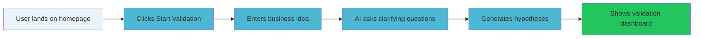

# Figma Toolchain Validation Report

**Date**: 2026-01-30
**Tester**: Visual Designer Agent
**File Tested**: `4yEXWnVK7tFJQzLKvIcsWo` (StartupAI Design Assets)
**Plan**: Figma Pro (Chris Walker Consulting)

## Executive Summary

The Figma MCP toolchain is **operational** for the Design Team. All read operations pass, diagram generation works, but Code Connect features are unavailable due to plan limitations.

**Overall Status**: PASS (with plan-based limitations)

---

## 1. Tool Inventory

### Read Operations (Official Figma MCP)

| Tool | Status | Notes |
|------|--------|-------|
| `whoami` | PASS | Authenticated as Chris Walker (chris00walker@gmail.com), Pro plan |
| `get_metadata` | PASS | Successfully read file structure, returns XML-style node tree |
| `get_design_context` | PASS | Generated React+Tailwind code from Figma design |
| `get_screenshot` | PASS | Rendered 400x400 compass illustration as image |
| `get_variable_defs` | PASS | Returns empty object (no variables defined in file) |

### Diagram Generation (FigJam)

| Tool | Status | Notes |
|------|--------|-------|
| `generate_diagram` | PASS | Created Mermaid flowchart, returned FigJam URL |

### Code Connect Features (Requires Org/Enterprise)

| Tool | Status | Notes |
|------|--------|-------|
| `get_code_connect_map` | BLOCKED | "Code Connect is only available on Organization and Enterprise plans" |
| `get_code_connect_suggestions` | BLOCKED | Same limitation |
| `add_code_connect_map` | BLOCKED | Same limitation |
| `send_code_connect_mappings` | NOT TESTED | Would fail due to plan limitation |

### Utility Tools

| Tool | Status | Notes |
|------|--------|-------|
| `create_design_system_rules` | PASS | Returns analysis prompt (guidance tool, no API call) |
| `get_figjam` | NOT TESTED | Requires FigJam file URL |

---

## 2. FigJam Diagram

**Generated**: StartupAI Onboarding User Journey

**URL**: [View/Edit in FigJam](https://www.figma.com/online-whiteboard/create-diagram/ef02de05-5093-4edb-ad3d-c4898d973c10?utm_source=other&utm_content=edit_in_figjam&oai_id=&request_id=e50beaa1-1ed4-4dab-ab65-2e85a9ba5da3)

**Mermaid Source**:


---

## 3. Design System Audit

### What Exists in File `4yEXWnVK7tFJQzLKvIcsWo`

| Asset | Node ID | Size | Description |
|-------|---------|------|-------------|
| Illustrations/404-Compass | 25:3 | 400x400px | Compass with misaligned needle for 404 page |

### File Structure
```
Page 1 (0:1)
└── Page Illustrations (25:2) - Section
    ├── Illustrations/404-Compass (25:3) - Frame
    ├── "404 Compass Illustration" (25:4) - Text label
    └── Asset metadata (25:5) - Text description
```

### Design Tokens Status
- **Variables Defined**: None (empty response from get_variable_defs)
- **Recommendation**: Define color/spacing variables in Figma to enable token sync

### Gaps Identified

| Missing Asset | Priority | Usage |
|---------------|----------|-------|
| Loading spinner illustration | High | All async operations |
| Empty state illustrations | High | Evidence explorer, dashboard |
| Success/error state illustrations | Medium | Form submissions, validation |
| Onboarding step illustrations | Medium | Wizard flow |
| Hero illustration | Medium | Landing page |
| Feature icons | Low | Navigation, cards |
| Brand logo variants | Low | Header, footer, favicon |

---

## 4. Recommendations

### What the Design Team CAN Do

1. **Read any Figma file** - Full access to design context, metadata, screenshots
2. **Generate code from designs** - React+Tailwind output ready for adaptation
3. **Create flowcharts in FigJam** - User journeys, architecture diagrams, workflows
4. **Screenshot designs for review** - Visual context for implementation
5. **Analyze file structure** - Understand component organization

### What the Design Team CANNOT Do (Plan Limitations)

1. **Code Connect** - Cannot link Figma components to codebase files
2. **Bidirectional sync** - No automatic component-to-code mapping

### What Requires Additional Setup

1. **Figma Console MCP** - Write access (create/modify designs) requires separate MCP
2. **Design variables** - Need to define tokens in Figma for extraction
3. **DALL-E integration** - For generating illustrations (separate MCP)

---

## 5. Blockers

### Critical (Prevents Core Workflow)
- None - all core read/generate operations work

### Significant (Limits Efficiency)
| Blocker | Impact | Mitigation |
|---------|--------|------------|
| Code Connect unavailable | Cannot auto-link Figma to code | Manual component mapping via naming convention |
| No design variables defined | Cannot sync tokens | Define variables in Figma or document tokens manually |

### Minor (Inconvenient but Workable)
| Blocker | Impact | Mitigation |
|---------|--------|------------|
| Pro plan limits some features | Missing Org/Enterprise capabilities | Upgrade if Code Connect becomes critical |
| 7-day asset URL expiration | Images expire from get_design_context | Persist immediately to Supabase Storage |

---

## 6. Test Evidence

### whoami Response
```json
{
  "handle": "Chris Walker",
  "email": "chris00walker@gmail.com",
  "plans": [
    {
      "name": "Chris Walker Consulting",
      "seat": "Full",
      "tier": "pro"
    }
  ]
}
```

### get_design_context Output
```tsx
const imgIllustrations404Compass = "https://www.figma.com/api/mcp/asset/dbf16803-c395-4112-90af-cb849ef12911";

export default function Illustrations404Compass() {
  return (
    <div className="border-2 border-[#9999b2] border-dashed overflow-clip relative rounded-[8px] size-full" data-name="Illustrations/404-Compass" data-node-id="25:3">
      
    </div>
  );
}
```

### Screenshot Rendered
- Successfully rendered 400x400px compass illustration
- Image shows: Stylized compass with teal/navy color scheme, misaligned needle, geometric design elements
- Suitable for 404 error page usage

---

## 7. Action Items

### Immediate (This Sprint)
- [x] Validate all read operations - COMPLETE
- [x] Generate test FigJam diagram - COMPLETE
- [ ] Document component naming convention for manual Code Connect alternative
- [ ] Define basic color variables in Figma file

### Short-term (Next 2 Weeks)
- [ ] Create missing illustration assets (prioritize loading spinner, empty states)
- [ ] Set up Figma Console MCP for write access if needed
- [ ] Establish design token extraction workflow

### Long-term (If Scale Requires)
- [ ] Evaluate Figma Organization plan for Code Connect
- [ ] Build automated design-to-code pipeline

---

## Appendix: Tool Reference

### Available Figma MCP Tools

| Tool | Purpose | Plan Required |
|------|---------|---------------|
| `whoami` | Check authentication | Any |
| `get_metadata` | Read file structure | Any |
| `get_design_context` | Generate code from design | Any |
| `get_screenshot` | Render node as image | Any |
| `get_variable_defs` | Read design tokens | Any |
| `generate_diagram` | Create FigJam flowchart | Any |
| `get_figjam` | Read FigJam content | Any |
| `create_design_system_rules` | Get analysis prompt | Any |
| `get_code_connect_map` | Read component links | Org/Enterprise |
| `get_code_connect_suggestions` | Get linking suggestions | Org/Enterprise |
| `add_code_connect_map` | Link component to code | Org/Enterprise |
| `send_code_connect_mappings` | Batch link components | Org/Enterprise |

---

**Report Generated**: 2026-01-30T[timestamp]
**Next Review**: After design variable setup
