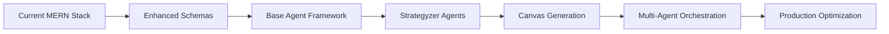

# 🚀 Strategyzer AI Platform - Professional Build Plan

## Executive Summary

This build plan translates the **Strategyzer AI Architecture** and **Engineering Implementation** specifications into a systematic, risk-managed development roadmap. The plan prioritizes MVP delivery while establishing scalable foundations for enterprise-grade AI consulting workflows.

---

## 📊 Project Overview

### **Scope & Objectives**

```yaml
Primary Goal: Transform existing MERN platform into Strategyzer-powered AI consulting engine
Success Criteria: 
  - Generate professional Value Proposition Canvas from client input
  - Execute multi-agent discovery workflows with 85%+ quality scores
  - Deliver client-ready visual artifacts (SVG/PDF exports)
  - Maintain <3 second API response times
  - Achieve <$2 per workflow execution cost

Timeline: 8 weeks (4 sprints × 2 weeks each)
Team Size: 1 senior full-stack engineer
Risk Level: Medium (AI integration complexity, cost management)
```

### **Technical Debt Assessment**

**Current State Analysis:**

- ✅ **Strong Foundation**: MERN stack properly configured
- ✅ **Production Ready**: Docker, GCP deployment, monitoring
- ✅ **AI Integration**: OpenAI API working, basic agents implemented
- ⚠️ **Schema Limitations**: Current models lack AI-optimized structure
- ⚠️ **Agent Architecture**: No systematic multi-agent orchestration
- ❌ **Canvas Generation**: No visual artifact generation capability

---

## 🏗️ Architecture Implementation Strategy

### **Build Approach: Incremental Enhancement**



**Rationale:**

- Minimize disruption to working system
- Enable continuous testing and validation
- Reduce integration risks
- Maintain production availability

---

## 📋 Sprint Breakdown

## **SPRINT 1: Foundation & Enhanced Data Layer (Weeks 1-2)**

### **Sprint Goal**

Establish AI-optimized data foundation and base agent architecture without disrupting current functionality.

### **Epic 1.1: Enhanced Database Schema**

#### **Story 1.1.1: Upgrade Client Model**

```yaml
Acceptance Criteria:
  - Client schema includes businessContext fields
  - Workflow status tracking for discovery/validation/scale
  - Canvas reference fields (valueProposition, businessModel, testingBusinessIdeas)
  - Backward compatibility with existing clients
  - Migration script for existing data

Technical Tasks:
  - Update /backend/models/Client.js with enhanced schema
  - Create migration script: /backend/scripts/migrateClients.js
  - Add validation middleware for new fields
  - Update API responses to include new fields
  - Write unit tests for Client model

Effort: 8 hours
Priority: High
Dependencies: None
```

#### **Story 1.1.2: Implement Enhanced Artefact Model**

```yaml
Acceptance Criteria:
  - AI-optimized artefact schema with embeddings support
  - Quality scoring and cost tracking fields
  - Workflow execution context tracking
  - Agent collaboration metadata
  - Proper indexing for performance

Technical Tasks:
  - Create /backend/models/Artefact.js with full schema
  - Implement compound indexes for query optimization
  - Add vector embedding field structure
  - Create artefact validation middleware
  - Write comprehensive model tests

Effort: 12 hours
Priority: High
Dependencies: None
```

#### **Story 1.1.3: Create Canvas Model**

```yaml
Acceptance Criteria:
  - Canvas model supports all three Strategyzer canvas types
  - Version control and collaboration tracking
  - Export format metadata (SVG, PNG, PDF)
  - Generation quality scoring
  - Client relationship management

Technical Tasks:
  - Implement /backend/models/Canvas.js
  - Add canvas type validation
  - Create canvas-client relationship indexes
  - Implement canvas versioning logic
  - Write model integration tests

Effort: 6 hours
Priority: Medium
Dependencies: Story 1.1.1
```

### **Epic 1.2: Base Agent Framework**

#### **Story 1.2.1: Implement BaseAgent Class**

```yaml
Acceptance Criteria:
  - Reusable agent architecture with OpenAI integration
  - Automatic cost tracking and quality assessment
  - Error handling and retry logic
  - Configurable model parameters
  - Comprehensive logging

Technical Tasks:
  - Create /backend/agents/base/BaseAgent.js
  - Implement OpenAI API integration with error handling
  - Add cost calculation for different models
  - Create quality assessment pipeline
  - Implement agent execution metrics
  - Write agent framework tests

Effort: 16 hours
Priority: High
Dependencies: Story 1.1.2
```

#### **Story 1.2.2: Agent Execution Pipeline**

```yaml
Acceptance Criteria:
  - Standardized agent input/output processing
  - Automatic artefact creation and storage
  - Context management between agents
  - Performance monitoring integration
  - Failure recovery mechanisms

Technical Tasks:
  - Implement agent execution orchestration
  - Create context passing mechanisms
  - Add performance monitoring hooks
  - Implement failure recovery logic
  - Create execution pipeline tests

Effort: 10 hours
Priority: High
Dependencies: Story 1.2.1
```

### **Epic 1.3: Development Infrastructure**

#### **Story 1.3.1: Enhanced Testing Framework**

```yaml
Acceptance Criteria:
  - Unit tests for all new models and agents
  - Integration tests for agent execution
  - Performance benchmarking tests
  - Cost tracking validation tests
  - 90%+ code coverage for new components

Technical Tasks:
  - Set up enhanced Jest configuration
  - Create test utilities for agent testing
  - Implement mock OpenAI responses
  - Add performance benchmarking tools
  - Create CI/CD test automation

Effort: 8 hours
Priority: Medium
Dependencies: Story 1.2.2
```

**Sprint 1 Deliverables:**

- ✅ Enhanced database schemas with migration scripts
- ✅ Base agent framework with OpenAI integration
- ✅ Comprehensive testing infrastructure
- ✅ Performance monitoring foundation

---

## 🧪 Test-Driven Development (TDD) Methodology

### **TDD Integration Across All Sprints**

TDD is the core development methodology driving quality, reliability, and maintainability throughout the build process.

#### **TDD Workflow for Each Story**

```yaml
TDD Cycle Implementation:
  1. RED Phase:
    - Write failing test that defines expected behavior
    - Test should fail for the right reason
    - Commit failing test to version control
  
  2. GREEN Phase:
    - Write minimal code to make test pass
    - Focus on functionality, not optimization
    - All tests must pass before proceeding
  
  3. REFACTOR Phase:
    - Improve code quality and structure
    - Optimize performance and readability
    - Ensure all tests continue to pass
    - Update documentation
```

#### **TDD Standards for AI Agents**

##### **Agent Test Requirements**

```yaml
Unit Test Coverage:
  - Input processing and validation: 100%
  - OpenAI API integration: 95% (mocked)
  - Output parsing and structuring: 100%
  - Quality assessment: 90%
  - Error handling: 95%

Integration Test Coverage:
  - End-to-end agent execution: 100%
  - Agent collaboration workflows: 90%
  - Database interactions: 95%
  - Performance benchmarks: 100%

Acceptance Test Coverage:
  - BDD scenario validation: 100%
  - Client workflow completion: 95%
  - Canvas generation quality: 90%
  - Export functionality: 100%
```

##### **TDD Test Categories by Sprint**

**Sprint 1 TDD Focus:**

```yaml
Database Schema Tests:
  - Model validation and constraints
  - Index performance verification
  - Migration script validation
  - Data integrity checks

Base Agent Framework Tests:
  - OpenAI API integration (mocked)
  - Cost calculation accuracy
  - Quality assessment algorithms
  - Error handling and recovery
  - Performance benchmarking
```

**Sprint 2 TDD Focus:**

```yaml
Strategyzer Agent Tests:
  - Customer Jobs Agent behavioral validation
  - Value Map Agent output structure
  - Agent collaboration and consensus
  - Strategyzer methodology compliance
  - Quality score validation (85%+ target)

Workflow Orchestration Tests:
  - Multi-agent execution sequencing
  - Failure recovery and rollback
  - Progress tracking accuracy
  - Resource utilization monitoring
```

**Sprint 3 TDD Focus:**

```yaml
Canvas Generation Tests:
  - Visual layout accuracy
  - Export format validation (SVG, PNG, PDF)
  - Branding application correctness
  - Interactive component functionality
  - Performance optimization validation

Frontend Component Tests:
  - React component rendering
  - User interaction handling
  - Real-time update functionality
  - Responsive design validation
```

**Sprint 4 TDD Focus:**

```yaml
Performance Optimization Tests:
  - Response time validation (<3s)
  - Concurrent execution handling
  - Memory usage optimization
  - Database query performance
  - Cost efficiency validation (<$2/canvas)

Production Readiness Tests:
  - Security vulnerability scanning
  - Load testing and stress testing
  - Monitoring and alerting validation
  - Disaster recovery procedures
```

#### **TDD Implementation Guidelines**

##### **Story-Level TDD Process**

```yaml
For Each User Story:
  1. Define Acceptance Criteria as BDD Scenarios
     - Given-When-Then format
     - Measurable success criteria
     - Edge case coverage
  
  2. Write Failing Tests First
     - Unit tests for individual functions
     - Integration tests for component interaction
     - End-to-end tests for user workflows
  
  3. Implement Minimal Viable Code
     - Focus on making tests pass
     - Avoid premature optimization
     - Maintain test coverage above 90%
  
  4. Refactor for Quality
     - Code review and pair programming
     - Performance optimization
     - Documentation updates
  
  5. Validate Against BDD Scenarios
     - Manual testing of user workflows
     - Performance benchmark validation
     - Quality metric verification
```

##### **AI-Specific TDD Patterns**

```yaml
OpenAI Integration Testing:
  - Mock API responses for consistent testing
  - Test prompt optimization and token efficiency
  - Validate response parsing and error handling
  - Monitor cost implications of changes

Quality Assurance Testing:
  - Automated quality scoring validation
  - Strategyzer methodology compliance checks
  - Output consistency across multiple runs
  - Human review integration testing

Performance Testing:
  - Agent execution time monitoring
  - Concurrent workflow handling
  - Memory usage and resource optimization
  - Cost per operation tracking
```

#### **TDD Tools and Configuration**

##### **Testing Stack**

```yaml
Backend Testing:
  Framework: Jest with ES Modules support
  Mocking: Jest mocks for OpenAI API
  Database: Postgres (Cloud SQL-compatible) via Testcontainers or Docker
  Coverage: Istanbul for code coverage reporting
  Performance: Node.js performance hooks

Frontend Testing:
  Framework: Jest + React Testing Library
  E2E Testing: Playwright for user workflows
  Visual Testing: Storybook for component isolation
  Performance: Lighthouse CI for performance metrics

Integration Testing:
  API Testing: Supertest for endpoint validation
  Workflow Testing: Custom test harness
  Performance Testing: Artillery for load testing
  Security Testing: OWASP ZAP integration
```

##### **Continuous Integration TDD Pipeline**

```yaml
GitHub Actions Workflow:
  1. Code Quality Checks:
     - ESLint and Prettier validation
     - TypeScript compilation
     - Dependency vulnerability scanning
  
  2. Unit Test Execution:
     - Jest test suite execution
     - Code coverage reporting (90% minimum)
     - Performance regression detection
  
  3. Integration Testing:
     - API endpoint validation
     - Database migration testing
     - Multi-agent workflow validation
  
  4. End-to-End Testing:
     - Playwright test execution
     - Canvas generation validation
     - User workflow completion
  
  5. Performance Validation:
     - Response time benchmarking
     - Memory usage monitoring
     - Cost calculation validation
  
  6. Security Scanning:
     - SAST (Static Application Security Testing)
     - Dependency vulnerability assessment
     - API security validation
```

#### **TDD Success Metrics**

```yaml
Code Quality Metrics:
  - Test Coverage: >90% for all components
  - Mutation Testing Score: >80%
  - Code Duplication: <5%
  - Cyclomatic Complexity: <10 per function

Performance Metrics:
  - Test Execution Time: <5 minutes for full suite
  - Agent Test Reliability: >99% pass rate
  - Performance Regression Detection: 100%
  - Cost Validation Accuracy: 100%

Quality Metrics:
  - Bug Detection Rate: >95% caught in testing
  - Production Defect Rate: <1% of releases
  - Test Maintenance Overhead: <10% of development time
  - Documentation Coverage: 100% of public APIs
```

---

## **SPRINT 2: Strategyzer Agent Implementation (Weeks 3-4)**

### **Sprint 2 Goal**

Implement core Strategyzer methodology agents with proper framework adherence and quality validation.

### **Epic 2.1: Value Proposition Canvas Agents**

#### **Story 2.1.1: Customer Jobs Agent**

```yaml
Acceptance Criteria:
  - Implements Strategyzer Jobs-to-be-done methodology
  - Categorizes jobs: functional, emotional, social
  - Provides job prioritization by importance/frequency
  - Outputs structured JSON with confidence scores
  - Achieves 85%+ quality score on test cases

Technical Tasks:
  - Create /backend/agents/strategyzer/CustomerJobsAgent.js
  - Implement Strategyzer-specific system prompts
  - Add job categorization and prioritization logic
  - Create context-aware input processing
  - Implement quality validation for job identification
  - Write comprehensive agent tests

Effort: 12 hours
Priority: High
Dependencies: Story 1.2.2
```

#### **Story 2.1.2: Customer Pains Agent**

```yaml
Acceptance Criteria:
  - Identifies customer pain points using Strategyzer framework
  - Categorizes pains by severity and frequency
  - Maps pains to customer journey stages
  - Provides pain relief opportunity assessment
  - Integrates with Customer Jobs Agent output

Technical Tasks:
  - Create /backend/agents/strategyzer/CustomerPainsAgent.js
  - Implement pain categorization methodology
  - Add pain-job relationship mapping
  - Create pain severity assessment logic
  - Implement agent integration tests

Effort: 10 hours
Priority: High
Dependencies: Story 2.1.1
```

#### **Story 2.1.3: Customer Gains Agent**

```yaml
Acceptance Criteria:
  - Identifies customer gains using Strategyzer methodology
  - Categorizes gains: required, expected, desired
  - Maps gains to customer value drivers
  - Provides gain creation opportunity assessment
  - Ensures consistency with jobs and pains

Technical Tasks:
  - Create /backend/agents/strategyzer/CustomerGainsAgent.js
  - Implement gain categorization framework
  - Add gain-job relationship validation
  - Create gain opportunity scoring
  - Write integration validation tests

Effort: 10 hours
Priority: High
Dependencies: Story 2.1.2
```

#### **Story 2.1.4: Value Map Agent**

```yaml
Acceptance Criteria:
  - Designs products/services addressing customer profile
  - Creates pain relievers mapped to specific pains
  - Develops gain creators for identified gains
  - Provides product-market fit assessment
  - Generates actionable value proposition recommendations

Technical Tasks:
  - Create /backend/agents/strategyzer/ValueMapAgent.js
  - Implement value map generation logic
  - Add fit assessment algorithms
  - Create value proposition optimization
  - Implement comprehensive value map tests

Effort: 14 hours
Priority: High
Dependencies: Story 2.1.3
```

### **Epic 2.2: Workflow Orchestration**

#### **Story 2.2.1: Strategyzer Workflow Service**

```yaml
Acceptance Criteria:
  - Orchestrates multi-agent Value Proposition Canvas generation
  - Manages agent dependencies and execution order
  - Provides real-time workflow progress tracking
  - Handles agent failures with graceful degradation
  - Generates comprehensive workflow metrics

Technical Tasks:
  - Create /backend/services/StrategyzrWorkflowService.js
  - Implement multi-agent orchestration logic
  - Add workflow progress tracking
  - Create failure recovery mechanisms
  - Implement workflow metrics collection
  - Write end-to-end workflow tests

Effort: 16 hours
Priority: High
Dependencies: Story 2.1.4
```

#### **Story 2.2.2: Enhanced API Routes**

```yaml
Acceptance Criteria:
  - New discovery workflow endpoint with progress tracking
  - Canvas retrieval endpoints with proper error handling
  - Artefact management with filtering and search
  - Workflow status monitoring endpoints
  - Proper API documentation

Technical Tasks:
  - Update /backend/server/routes.js with new endpoints
  - Add workflow progress tracking endpoints
  - Implement canvas management routes
  - Add artefact search and filtering
  - Create API documentation
  - Write API integration tests

Effort: 10 hours
Priority: Medium
Dependencies: Story 2.2.1
```

**Sprint 2 Deliverables:**

- ✅ Complete Value Proposition Canvas agent suite
- ✅ Multi-agent workflow orchestration
- ✅ Enhanced API with workflow management
- ✅ Real-time progress tracking

---

## **SPRINT 3: Canvas Generation & Visualization (Weeks 5-6)**

### **Sprint 3 Goal**

Implement visual canvas generation and interactive frontend components for professional client deliverables.

### **Epic 3.1: Canvas Generation Engine**

#### **Story 3.1.1: Canvas Generator Agent**

```yaml
Acceptance Criteria:
  - Generates structured canvas data from agent outputs
  - Creates professional visual layouts
  - Supports multiple export formats (SVG, PNG, PDF)
  - Maintains Strategyzer visual standards
  - Provides canvas quality assessment

Technical Tasks:
  - Create /backend/agents/canvas/CanvasGeneratorAgent.js
  - Implement canvas layout algorithms
  - Add SVG generation for Value Proposition Canvas
  - Create PDF export functionality
  - Implement canvas quality validation
  - Write canvas generation tests

Effort: 18 hours
Priority: High
Dependencies: Story 2.2.1
```

#### **Story 3.1.2: Visual Rendering Service**

```yaml
Acceptance Criteria:
  - Renders canvas data into visual formats
  - Supports responsive canvas layouts
  - Maintains consistent Strategyzer branding
  - Optimizes for print and digital viewing
  - Provides rendering performance metrics

Technical Tasks:
  - Create /backend/services/VisualRenderingService.js
  - Implement SVG template system
  - Add responsive layout logic
  - Create branding and styling system
  - Implement rendering optimization
  - Write visual rendering tests

Effort: 14 hours
Priority: High
Dependencies: Story 3.1.1
```

### **Epic 3.2: Frontend Canvas Components**

#### **Story 3.2.1: Value Proposition Canvas Component**

```yaml
Acceptance Criteria:
  - Interactive Value Proposition Canvas display
  - Real-time updates during workflow execution
  - Clickable sections with detailed views
  - Export functionality for client delivery
  - Mobile-responsive design

Technical Tasks:
  - Create /frontend/src/components/canvas/ValuePropositionCanvas.tsx
  - Implement interactive canvas sections
  - Add real-time update functionality
  - Create export button integration
  - Implement responsive design
  - Write component tests

Effort: 16 hours
Priority: High
Dependencies: Story 3.1.2
```

#### **Story 3.2.2: Canvas Management Dashboard**

```yaml
Acceptance Criteria:
  - Canvas library with version history
  - Canvas sharing and collaboration features
  - Canvas comparison tools
  - Client canvas portfolio view
  - Canvas analytics and insights

Technical Tasks:
  - Create /frontend/src/components/dashboard/CanvasManagement.tsx
  - Implement canvas library interface
  - Add version control visualization
  - Create canvas comparison tools
  - Implement analytics dashboard
  - Write dashboard tests

Effort: 12 hours
Priority: Medium
Dependencies: Story 3.2.1
```

### **Epic 3.3: Client Experience Enhancement**

#### **Story 3.3.1: Workflow Progress Visualization**

```yaml
Acceptance Criteria:
  - Real-time workflow progress indicators
  - Agent execution status display
  - Quality metrics visualization
  - Cost tracking dashboard
  - Estimated completion times

Technical Tasks:
  - Create /frontend/src/components/workflow/ProgressTracker.tsx
  - Implement real-time progress updates
  - Add quality metrics display
  - Create cost tracking visualization
  - Implement time estimation logic
  - Write progress tracking tests

Effort: 10 hours
Priority: Medium
Dependencies: Story 2.2.2
```

**Sprint 3 Deliverables:**

- ✅ Professional canvas generation with multiple export formats
- ✅ Interactive frontend canvas components
- ✅ Enhanced client experience with real-time progress
- ✅ Canvas management and analytics dashboard

---

## **SPRINT 4: Production Optimization & Advanced Features (Weeks 7-8)**

### **Sprint 4 Goal**

Optimize system performance, implement advanced AI features, and prepare for production scaling.

### **Epic 4.1: Performance Optimization**

#### **Story 4.1.1: Database Query Optimization**

```yaml
Acceptance Criteria:
  - All queries execute in <100ms for typical datasets
  - Proper indexing for all search patterns
  - Query result caching for repeated requests
  - Database connection pooling optimization
  - Query performance monitoring

Technical Tasks:
  - Analyze and optimize Postgres (Cloud SQL) queries
  - Implement query result caching with Redis
  - Add database performance monitoring
  - Optimize connection pooling
  - Create performance benchmarking suite
  - Write performance tests

Effort: 12 hours
Priority: High
Dependencies: None
```

#### **Story 4.1.2: AI Cost Optimization**

```yaml
Acceptance Criteria:
  - Workflow execution cost <$2 per complete canvas
  - Intelligent prompt optimization for token efficiency
  - Response caching for similar inputs
  - Model selection optimization by use case
  - Cost monitoring and alerting

Technical Tasks:
  - Implement prompt optimization algorithms
  - Add response caching system
  - Create model selection logic
  - Implement cost monitoring dashboard
  - Add cost alerting system
  - Write cost optimization tests

Effort: 14 hours
Priority: High
Dependencies: Story 4.1.1
```

### **Epic 4.2: Advanced AI Features**

#### **Story 4.2.1: Vector Search Implementation**

```yaml
Acceptance Criteria:
  - Semantic search across all artefacts
  - Similar canvas discovery
  - Context-aware agent recommendations
  - Duplicate detection and consolidation
  - Search performance <200ms

Technical Tasks:
  - Implement vector embedding generation
  - Enable pgvector in Cloud SQL for semantic search
  - Create semantic search endpoints
  - Implement similarity algorithms
  - Add search performance optimization
  - Write vector search tests

Effort: 16 hours
Priority: Medium
Dependencies: Story 4.1.2
```

#### **Story 4.2.2: Agent Collaboration System**

```yaml
Acceptance Criteria:
  - Agents can debate and reach consensus
  - Quality validation through peer review
  - Collaborative canvas refinement
  - Conflict resolution mechanisms
  - Collaboration audit trails

Technical Tasks:
  - Create /backend/services/AgentCollaborationService.js
  - Implement debate and consensus algorithms
  - Add peer review validation
  - Create conflict resolution logic
  - Implement collaboration tracking
  - Write collaboration tests

Effort: 18 hours
Priority: Low
Dependencies: Story 4.2.1
```

### **Epic 4.3: Production Readiness**

#### **Story 4.3.1: Comprehensive Monitoring**

```yaml
Acceptance Criteria:
  - Application performance monitoring (APM)
  - AI workflow success rate tracking
  - Cost and usage analytics
  - Error tracking and alerting
  - Business metrics dashboard

Technical Tasks:
  - Implement comprehensive logging
  - Add APM integration (Datadog/New Relic)
  - Create business metrics tracking
  - Implement alerting system
  - Create monitoring dashboard
  - Write monitoring tests

Effort: 10 hours
Priority: High
Dependencies: None
```

#### **Story 4.3.2: Security & Compliance**

```yaml
Acceptance Criteria:
  - API rate limiting and authentication
  - Data encryption at rest and in transit
  - PII handling compliance
  - Audit logging for all operations
  - Security vulnerability scanning

Technical Tasks:
  - Implement API authentication and rate limiting
  - Add data encryption layers
  - Create PII handling middleware
  - Implement audit logging
  - Add security scanning to CI/CD
  - Write security tests

Effort: 12 hours
Priority: High
Dependencies: Story 4.3.1
```

**Sprint 4 Deliverables:**

- ✅ Production-optimized performance (<3s response times)
- ✅ Advanced AI features with vector search
- ✅ Comprehensive monitoring and alerting
- ✅ Enterprise-grade security and compliance

---

## 🎯 Success Metrics & KPIs

### **Technical Metrics**

```yaml
Performance:
  - API Response Time: <3 seconds (95th percentile)
  - Database Query Time: <100ms (average)
  - Canvas Generation Time: <30 seconds
  - System Uptime: >99.5%

Quality:
  - Agent Quality Score: >85% (average)
  - Canvas Completion Rate: >95%
  - Error Rate: <1%
  - Test Coverage: >90%

Cost Efficiency:
  - Workflow Execution Cost: <$2 per canvas
  - Token Efficiency: >80% useful content
  - Infrastructure Cost: <$500/month
  - Development Velocity: >15 story points/sprint
```

### **Business Metrics**

```yaml
User Experience:
  - Canvas Generation Success Rate: >95%
  - Client Satisfaction Score: >4.5/5
  - Time to First Canvas: <5 minutes
  - Feature Adoption Rate: >80%

Operational:
  - Deployment Frequency: Daily
  - Lead Time for Changes: <2 days
  - Mean Time to Recovery: <1 hour
  - Change Failure Rate: <5%
```

---

## ⚠️ Risk Management

### **High-Risk Items**

#### **Risk 1: AI Cost Overruns**

```yaml
Probability: Medium
Impact: High
Mitigation:
  - Implement strict cost monitoring and alerting
  - Add circuit breakers for expensive operations
  - Create cost budgets per client/workflow
  - Implement prompt optimization algorithms
Contingency: Fallback to simpler models if costs exceed budget
```

#### **Risk 2: AI Quality Inconsistency**

```yaml
Probability: Medium
Impact: Medium
Mitigation:
  - Implement comprehensive quality scoring
  - Add human review checkpoints for low-quality outputs
  - Create quality improvement feedback loops
  - Implement A/B testing for prompt optimization
Contingency: Manual review process for critical client deliverables
```

#### **Risk 3: Performance Degradation**

```yaml
Probability: Low
Impact: High
Mitigation:
  - Implement comprehensive performance monitoring
  - Add auto-scaling for high-load periods
  - Create performance regression testing
  - Implement caching at multiple layers
Contingency: Horizontal scaling and load balancing
```

### **Medium-Risk Items**

#### **Risk 4: Integration Complexity**

```yaml
Probability: Medium
Impact: Medium
Mitigation:
  - Incremental integration approach
  - Comprehensive integration testing
  - Rollback procedures for each deployment
  - Feature flags for gradual rollout
```

---

## 🚀 Deployment Strategy

### **Deployment Approach: Blue-Green with Feature Flags**

```yaml
Phase 1: Schema Migration (Week 1)
  - Deploy enhanced schemas to staging
  - Run migration scripts on production replica
  - Validate data integrity
  - Deploy to production during low-traffic window

Phase 2: Agent Framework (Week 2)
  - Deploy base agent framework behind feature flag
  - Enable for internal testing only
  - Gradual rollout to test clients
  - Full rollout after validation

Phase 3: Strategyzer Agents (Week 4)
  - Deploy agents to staging environment
  - Run comprehensive integration tests
  - Deploy to production with limited client access
  - Monitor performance and quality metrics

Phase 4: Canvas Generation (Week 6)
  - Deploy canvas generation behind feature flag
  - Test with internal clients first
  - Gradual rollout based on quality metrics
  - Full rollout after client validation

Phase 5: Production Optimization (Week 8)
  - Deploy optimizations during maintenance window
  - Monitor performance improvements
  - Validate cost reductions
  - Enable advanced features gradually
```

---

## 📋 Definition of Done

### **Story-Level DoD**

- [ ] Code implemented and peer reviewed
- [ ] Unit tests written and passing (>90% coverage)
- [ ] Integration tests passing
- [ ] Documentation updated
- [ ] Performance benchmarks met
- [ ] Security review completed
- [ ] Deployed to staging and validated

### **Sprint-Level DoD**

- [ ] All sprint stories completed
- [ ] End-to-end tests passing
- [ ] Performance regression tests passing
- [ ] Security scan completed
- [ ] Demo prepared and delivered
- [ ] Production deployment plan reviewed
- [ ] Monitoring and alerting configured

### **Release-Level DoD**

- [ ] All acceptance criteria met
- [ ] Production deployment successful
- [ ] Monitoring confirms system health
- [ ] Client validation completed
- [ ] Documentation published
- [ ] Team retrospective completed
- [ ] Next sprint planning completed

---

## 🎉 Expected Outcomes

Upon completion of this 8-week build plan, the platform will deliver:

### **Core Capabilities**

- ✅ **Professional Value Proposition Canvas Generation**: AI-powered, Strategyzer-compliant canvases
- ✅ **Multi-Agent Workflow Orchestration**: Sophisticated agent collaboration and consensus
- ✅ **Visual Artifact Export**: Client-ready SVG, PNG, and PDF deliverables
- ✅ **Real-Time Progress Tracking**: Transparent workflow execution monitoring
- ✅ **Cost-Effective Operations**: <$2 per canvas with 85%+ quality scores

### **Technical Excellence**

- ✅ **Scalable Architecture**: Production-ready MERN stack with AI optimization
- ✅ **Performance Optimization**: <3 second response times with comprehensive monitoring
- ✅ **Quality Assurance**: 90%+ test coverage with automated quality validation
- ✅ **Security & Compliance**: Enterprise-grade security with audit trails

### **Business Value**

- ✅ **Client-Ready Deliverables**: Professional consulting artifacts matching top-tier firms
- ✅ **Operational Efficiency**: Automated workflows reducing manual consulting effort
- ✅ **Scalable Revenue Model**: Platform capable of handling multiple concurrent clients
- ✅ **Competitive Differentiation**: AI-powered Strategyzer methodology implementation

This build plan transforms the architectural vision into executable reality while maintaining engineering excellence and business value delivery.
